# healthcp Architecture

> Generated by Opsera Code-to-Cloud Enterprise v1.4

## System Overview

```mermaid
graph TB
    subgraph "GitHub"
        GH[GitHub Repository]
        GHA[GitHub Actions]
    end

    subgraph "Container Registry"
        ECR[AWS ECR<br/>healthcp]
    end

    subgraph "GitOps"
        ARGO[ArgoCD Hub]
    end

    subgraph "AWS EKS Cluster"
        subgraph "DEV Environment"
            DEV_NS[healthcp-dev]
            DEV_DEPLOY[Rolling Deployment]
        end

        subgraph "QA Environment"
            QA_NS[healthcp-qa]
            QA_CANARY[Canary Rollout<br/>10%→30%→60%→100%]
        end

        subgraph "Staging Environment"
            STG_NS[healthcp-staging]
            STG_BG[Blue-Green<br/>Preview + Active]
        end
    end

    subgraph "External"
        R53[Route53 DNS]
        USERS[Users]
    end

    GH -->|push| GHA
    GHA -->|build & push| ECR
    GHA -->|update manifests| GH
    GH -->|sync| ARGO
    ARGO -->|deploy| DEV_NS
    ARGO -->|deploy| QA_NS
    ARGO -->|deploy| STG_NS

    DEV_NS --> DEV_DEPLOY
    QA_NS --> QA_CANARY
    STG_NS --> STG_BG

    R53 --> DEV_NS
    R53 --> QA_NS
    R53 --> STG_NS
    USERS --> R53
```

## Deployment Pipeline

## Environment Details

| Environment | Strategy | Namespace | URL |
|-------------|----------|-----------|-----|
| DEV | Rolling Update | healthcp-dev | https://healthcp-dev.agent.opsera.dev |
| QA | Canary (10%→30%→60%→100%) | healthcp-qa | https://healthcp-qa.agent.opsera.dev |
| Staging | Blue-Green | healthcp-staging | https://healthcp-staging.agent.opsera.dev |

## Quality Gates

| Gate | Tool | Description |
|------|------|-------------|
| 🔐 Secrets | Gitleaks | Scans git history for leaked secrets |
| 🔍 SAST | SonarQube | Static code analysis |
| 🛡️ SCA | Grype | Dependency vulnerability scanning |

## Integrations

| Integration | Purpose |
|-------------|---------|
| Slack | Deployment notifications |
| Jira | Deployment tracking tickets |
| New Relic | APM for canary analysis |
| Route53 | DNS automation |

---
*Generated: $(date -u +"%Y-%m-%d %H:%M UTC") | Code-to-Cloud Enterprise v1.4*
